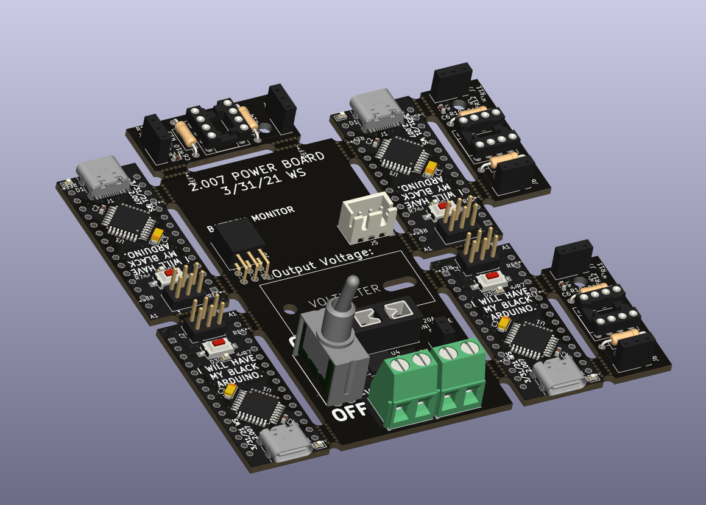
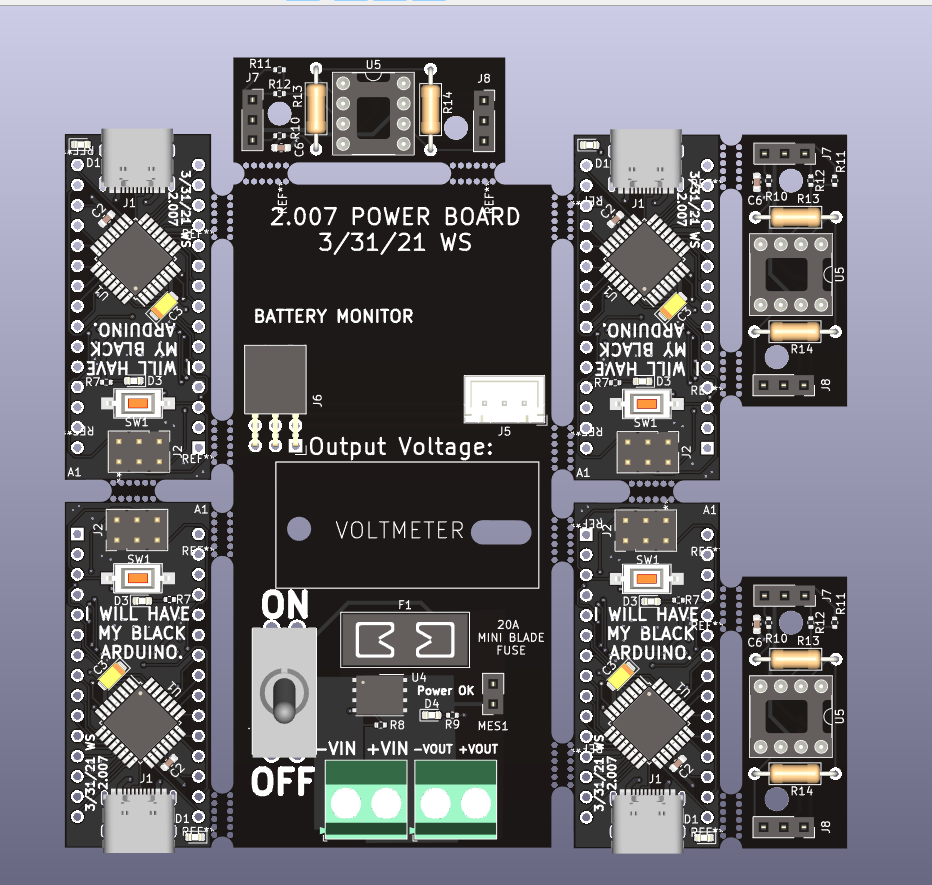

# 2.007 Power Distribution Board
Battery protection circuit for 2.007 "Legacy" Robotics Competiton @ MIT, Spring 2022

[Interactive BOM](https://htmlpreview.github.io/?https://raw.githubusercontent.com/wszeto9/2_679_PCB/main/Arduino_USB_C/arduino_usb_c/ibom.html)

<h2> Features:</h2>
<ul>
<li>20A socketable fused input</li>
<li>Reverse polarity protection</li>
<li> Voltage Monitoring components to prevent overdischarging of batteries </li>
  <li> Black colored Arduino Nano for looks </li>
  <li> Op-Amp breakout board for additional gain on current sensors</li>
</ul>

PCBA

Top
