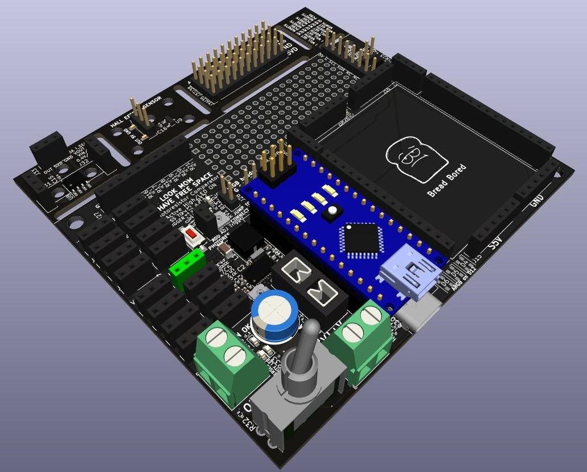
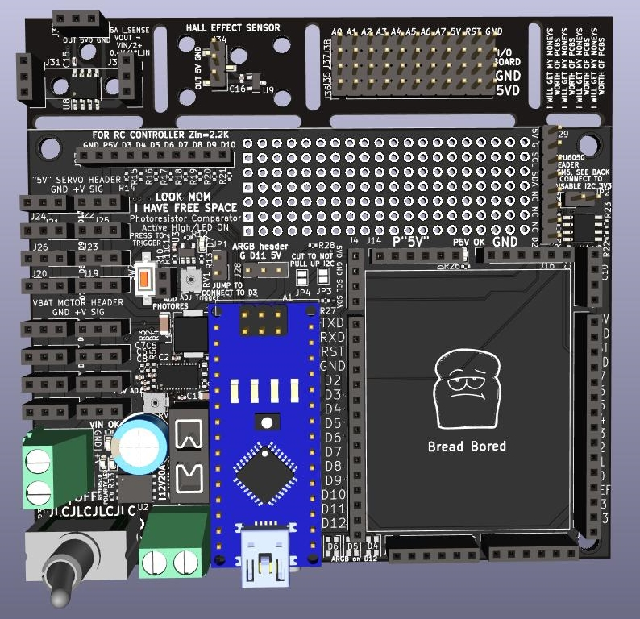
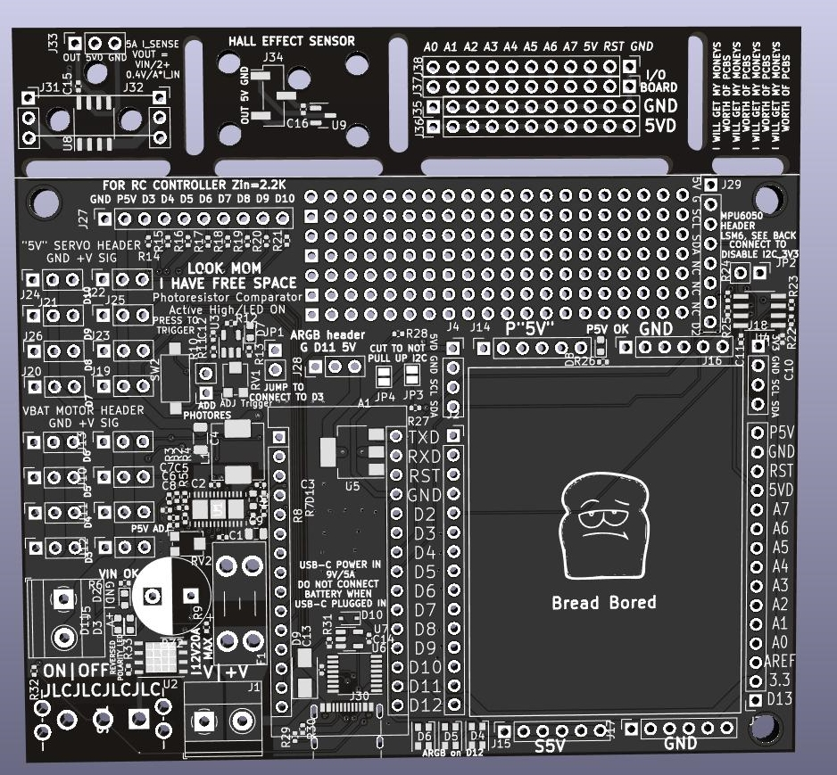

# 2.679/2.007 Carrier Board
High Power throughput board for the 2.007 "Legacy" Robotics Competiton @ MIT, Spring 2022

<h2> Features:</h2>
<ul>
<li>20A socketable fused input</li>
<li>Reverse polarity protection with warning lights and buzzer to alert incorrect wiring</li>
<li>9V USB-C Power Delivery Input to run off larger battery packs during testing</li>
<li>Protection Circuit to prevent USB-C from backcharging battery</li>
<li>Motor headers with 8.2V Output</li>
<li>Adjustable Servo voltage from 5V to Battery voltage</li>
<li>6A Syncronous Buck converter to reduce the voltage difference between the servo voltage and battery boltage</li>
<li>16 Actuator Ports (8 individually controllable)</li>
<li>Comparator Circuit for light based start signal, directly wired to an Arduino Interrupt</li>
<li>Mechanically Adjustable trigger point for photoresistor interrupt input</li>
<li>8-channel RC controller input for compatability with Gobilda RC Receiver</li>
<li>MPU6050 and LSM6DS33 Header for heading measurements with interrupt pins connected to D2</li>
<li> 5V and 3.3V I2C headers for a multitude of sensor inputs</li>
<li>ARGB Debugging LEDs to offer more variations of debugging signals</li>
<li>ARGB Header to decorate robot in <i><b>light</b></i></li>
<li>Breakout boards for Hall Effect Sensors, In-Line current sensors, and I/O Breakout boards </li>
<li>Fun Silkscreen messages for my favorite professors </li>
</ul>

PCBA

Top

Top Unpopulated Board

